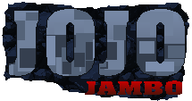

# RunOrDie - Endless Adventure Action Game



Welcome to RunOrDie, an exhilarating endless adventure action game that will test your reflexes and take you on a thrilling journey through challenging landscapes. Strap in for an adrenaline-pumping experience where the only rule is to run or... well, you know the rest!

## Features

- **Endless Adventure:** Run through dynamically generated levels that offer a unique experience every time.
- **Action-Packed Gameplay:** Dodge obstacles, overcome challenges, and face epic boss battles.
- **Upgradeable Characters:** Unlock and upgrade characters with special abilities for an edge in the race.
- **Power-ups and Boosts:** Collect power-ups and boosts to enhance your speed and abilities.
- **Leaderboards:** Compete with friends and players worldwide to claim the top spot on the leaderboards.

## How to Play

1. **Start Running:** Launch the game and choose your character.
2. **Avoid Obstacles:** Navigate through obstacles by jumping, sliding, or using special abilities.
3. **Collect Coins:** Grab coins to unlock new characters and power-ups.
4. **Challenge Bosses:** Encounter epic bosses at the end of each level. Can you defeat them?

## Installation

To run the game locally, follow these steps:

1. Clone the repository:
   ```bash
   git clone https://github.com/your_username/RunOrDie.git
